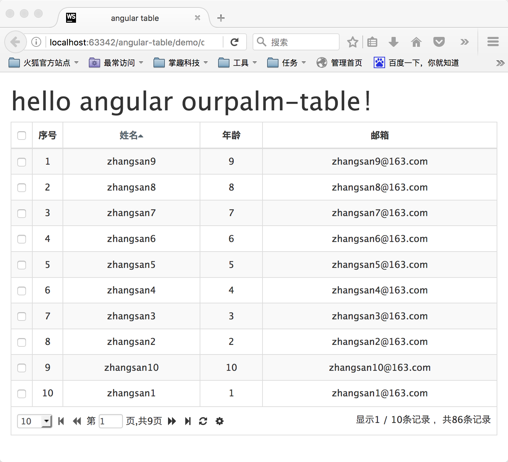

#angular-table

基于angular、bootstrap的表格控件，提供了一些简单的、声明式配置

####以简单例子开始(服务器加载数据)
```xml
<table ourpalm-table="vm.table" class="table table-bordered table-striped table-hover text-center">
    <tr ng-repeat="$row in $rows">
        <td header="全选" field="select" checkbox="true" style="width:30px;"></td>
        <td header="序号" field="number" rownumbers="true" style="width:40px;"></td>
        <td header="姓名" field="name">{{$row.name}}</td>
        <td header="年龄" field="age">{{$row.age}}</td>
        <td header="邮箱" field="email">{{$row.email}}</td>
    </tr>
</table>
```

```js
.controller('DemoController', function ($timeout, OurpalmTable) {
    var vm = this;

    vm.table = new OurpalmTable({
        loadData: function (table, callback) {
            var options = table.getOptions();

            var i = (options.currentPage - 1) * options.pageSize + 1;
            var size = i + options.pageSize;
            size = size > 86 ? 86 : size;
            //构造服务器假数据
            var rows = [];
            for (; i < size; i++) {
                rows.push({
                    name: `zhangsan${i}`,
                    age: i,
                    email: `zhangsan${i}@163.com`
                });
            }

            $timeout(function () {
                callback({
                    total: 86,
                    rows: rows
                });
            }, 300);
        }

    });
});
```


####以简单例子开始(内存指定数据)
```xml
<table ourpalm-table="vm.table" class="table table-bordered table-striped table-hover text-center">
    <tr ng-repeat="$row in $rows">
        <td header="全选" field="select" checkbox="true" style="width:30px;"></td>
        <td header="序号" field="number" rownumbers="true" style="width:40px;"></td>
        <td header="姓名" field="name">{{$row.name}}</td>
        <td header="年龄" field="age">{{$row.age}}</td>
        <td header="邮箱" field="email">{{$row.email}}</td>
    </tr>
</table>
```

```js
.controller('DemoController', function ($timeout, OurpalmTable) {
    var vm = this;

    var start = 1, end = 86;
    //构造内存假数据
    var rows = [];
    for (; start < end; start++) {
        rows.push({
            name: `zhangsan${start}`,
            age: start,
            email: `zhangsan${start}@163.com`
        });
    }


    vm.table = new OurpalmTable({
        serverLoad: false,
        data: rows
    });
});
```


####全部配置项
```xml
<table ourpalm-table="vm.table"
       //配置方式一
       options="vm.options"
       //配置方式二
       options="{ skipPage: true, serverSort: true, pagination: true, singleSelect: true, pageList: [10,20,30,50,100], defaultPageSize: 10 }"
       //配置方式三
       skip-page="false"
       server-sort="false"
       pagination="false"
       single-select="true"
       page-list="[10, 30, 50, 100]"
       default-page-size="10"
       server-load="false"
       class="table table-bordered table-striped table-hover text-center">
    <tr ng-repeat="$row in $rows">
        <td header="全选" field="name" sort="false" checkbox="true" sort-order="asc" style="width:30px;"></td>
        <td header="序号" field="name" sort="false" rownumbers="true" sort-order="asc" show="true" style="width:40px;"></td>
        <td header="姓名" field="name" sort="true" checkbox="false" sort-order="asc">{{$row.name}}</td>
        <td header="年龄" field="age" sort="true" checkbox="false" sort-order="desc">{{$row.age}}</td>
        <td header="邮箱" field="email" sort="false" checkbox="false" sort-order="desc">{{$row.email}}</td>
    </tr>
</table>
```

```js
.controller('DemoController', function ($timeout, OurpalmTable) {
    var vm = this;

    vm.table = new OurpalmTable({
        //配置方式四
        cacheKey: 'table01', //配置客户端缓存
        cachePageSize: true, //客户端记录设置的页大小
        cacheColumns: true, //客户端记录设置的隐藏列与显示列
        skipPage: true,
        serverSort: false,
        pagination: true,
        singleSelect: false,
        pageList: [10, 20, 30],
        defaultPageSize: 10,
        serverLoad: true,
        //data: rows, //内存加载数据 serverLoad:false
        loadData: function (table, callback) {
            var options = table.getOptions();

            var i = (options.currentPage - 1) * options.pageSize + 1;
            var size = i + options.pageSize;
            size = size > 86 ? 86 : size;
            //构造服务器假数据
            var rows = [];
            for (; i < size; i++) {
                rows.push({
                    name: `zhangsan${i}`,
                    age: i,
                    email: `zhangsan${i}@163.com`
                });
            }

            $timeout(function () {
                callback({
                    total: 86,
                    rows: rows
                });
            }, 300);
        }
    });

    vm.options = {
        skipPage: false,
        serverSort: false,
        pagination: false,
        singleSelect: true,
        pageList: [10, 20, 30, 50, 100],
        defaultPageSize: 100
    };

    $timeout(function () {
        console.info('getDisplayedColumns', vm.table.getDisplayedColumns());
        console.info('getDisplayedRows', vm.table.getDisplayedRows());
        console.info('getOptions', vm.table.getOptions());
        console.info('getSelectedRows', vm.table.getSelectedRows());
        console.info('getSortColumns', vm.table.getSortColumns());
    }, 5000);
});
```


####表属性

|	属性名				  |	 属性值类型 		  | 	   默认值 	   |		描述 					|
|-------------------------|-------------------|--------------------|-----------------------------|
|	pagination     		  |     boolean   	  |		true		   |	是否显示分页控件		|
|	singleSelect    	  |     boolean   	  |		false		   |	是否限制只能选中一行			|
|	serverSort     		  |     boolean   	  |		true	   	   |	是否要服务器排序		|
|	serverLoad            |     boolean   	  |		true		   |	是否是服务器加载数据	|
|	pageList     		  |     array 		  |	[10,20,30,40,50]   |	在设置分页属性的时候 初始化页面大小选择列表		|
|	defaultPageSize       |     int   		  |		10			   |	在设置分页属性的时候初始化页面大小	|
|	skipPage              |     boolean   	  |		true		   |	在设置分页属性的时候是否允许用户跳转页面	|
|	cacheKey              |     string   	  |		''  		   |	客户端存储table信息是对应存放在localStorage中的key	|
|	cachePageSize         |     boolean   	  |		false		   |	是否在客户端存储table的页大小,刷新的时候页大小不变,保存在localStorage中,key为${cacheKey}-pageSize	|
|	cacheColumns          |     boolean   	  |		false		   |	是否在客户端存在table的列隐藏信息,刷新的时候列的隐藏信息不变,保存在localStorage中,key为${cacheKey}-columns	|
|	pagePosition          |     string   	  |		bottom		   |	分页条在那里显示可取值 'bottom', 'top', 'both'	|


####列属性

|	属性名				  |	 属性值类型 		  | 	   默认值 	   |		描述 					|
|-------------------------|-------------------|--------------------|-----------------------------|
|	header     		 	  |     string   	  |		''			   |	表头					   |
|	field		    	  |     string   	  |		''			   |	字段名称		      	  |
|	sort	     		  |     boolean   	  |		false	   	   |	是否列排序				 |
|	sortOrder     		  |     string 		  |		asc			   |	列排序方向,取值 asc 或 desc	|
|	rownumbers		      |     boolean		  |		false		   |	是否为行号列 1...*				|
|	show			      |     boolean		  |		true		   |	是否隐藏列				|
|	checkbox		      |     boolean		  |		false		   |	是否为多选列				|


####方法

|	方法名				  |	 参数 		      | 	            	描述 					|
|-------------------------|-------------------|-------------------------------------------------|
|	getDisplayedColumns   |                   |		 获取显示的列信息				   |
|	getDisplayedRows      |                   |		 获取显示的行信息				   |
|	getSelectedRows       |                   |		 获取选中的行信息				   |
|	getSortColumns        |                   |		 获取排序的列信息				   |
|	getOptions            |                   |		 获取表格的实时信息,如 currentPage, pageSize  |
|	page                  |   int[可选]       |		 获取表格的当前页，获取设置表格的当前页  |
|	size                  |   int[可选]       |		 获取表格的当前页大小，获取设置表格的当前页大小  |


####获取table值
* 获取当前页 `table.getOptions().currentPage`
* 获取页大小 `table.getOptions().pageSize`
* 获取选中的行 `table.getSelectedRows()`
* 获取排序的列 `table.getSortColumns()`
* 获取显示的列 `table.getDisplayedColumns()`
* 获取显示的行 `table.getDisplayedRows()`
* 重新加载数据 `table.reload()`
* 获取当前第几页 `table.page()`
* 设置当前第几页 `table.page(10)`
* 获取当前分页大小 `table.size()`
* 设置当前分页大小 `table.size(100)`

*注意：所有数据为只读的，不要自己修改数据*


####命名注意

* 表属性和列属性的名字，在html标签中将驼峰命名改为-分隔命名，如：
 1. `<td pageList="[10,20,30]"></td>` 应写为 `<td page-list="[10,20,30]"></td>`
 2. `<td defaultPageSize="10"></td>` 应写为 `<td default-page-size="10"></td>`

* **ng-repeat**中的行数据名称必须要**$row**和**$rows**，如：
 1. `<tr ng-repeat="$row in $rows"></tr>`

* **checkbox**列和**rownumbers**列不支持排序，如：
 1. `<td header="全选" field="name" checkbox="true"></td>`
 2. `<td header="全选" field="name" rownumbers="true"></td>`


####demo

[简单配置-服务器加载数据](./demo/demo01.html) [在线实例](http://runjs.cn/code/nwygfmro)

[简单配置-内存加载数据](./demo/demo02.html) [在线实例](http://runjs.cn/code/7ifusq0w)

[全部配置](./demo/demo03.html) [在线实例](http://runjs.cn/code/kcufklvq)





