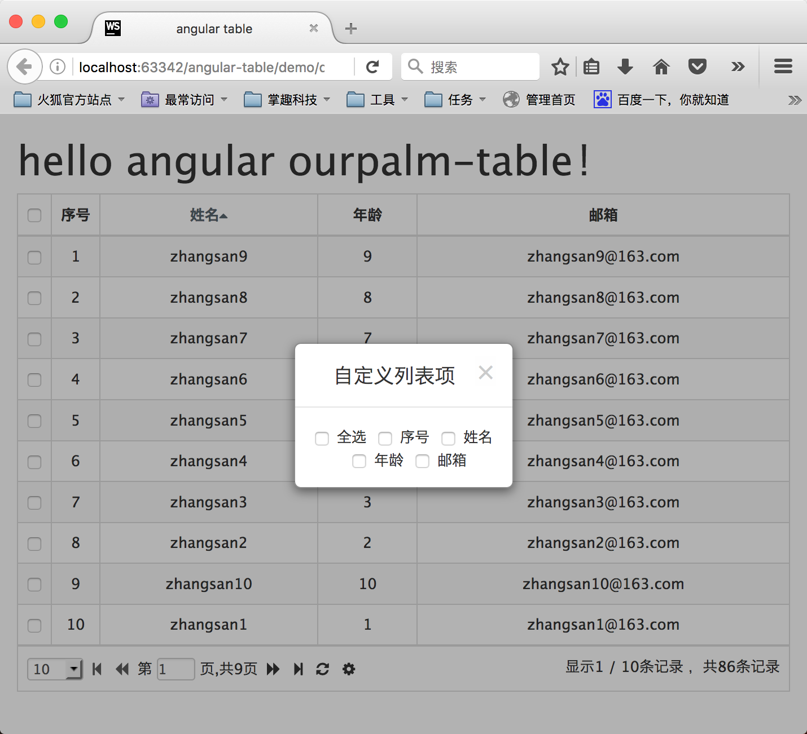

#ourpalm-util-table

基于angular、bootstrap的表格控件，提供了一些简单的、声明式配置

####以简单例子开始
```xml
<table ourpalm-table="vm.loadData(table, callback);" server-sort="false" pagination="true" single-select="false" page-list="[10, 30, 50, 100]" default-page-size="10" class="table table-bordered table-striped table-hover text-center">
    <tr ng-repeat="$row in $rows">
        <td table-column header="全选" field="name" sort="false" checkbox="true" sort-order="asc" style="width:30px;"></td>
        <td table-column header="序号" field="name" sort="true" rownumbers="true" sort-order="asc" hide="true" style="width:40px;"></td>
        <td table-column header="姓名" field="name" sort="true" checkbox="false" sort-order="asc">{{$row.name}}</td>
        <td table-column header="年龄" field="age" sort="false" checkbox="false" sort-order="desc">{{$row.age}}</td>
    </tr>
</table>
```

```js
.controller('ExampleController', function ($timeout) {
    var vm = this;
    vm.loadData = function (table, callback) {
    	//构造假数据
        var rows = [];
        for (var i = 0; i < table.pageSize; i++) {
            rows.push({
                name: 'zhangsan' + i,
                age: i
            });
        }

        $timeout(function () {
            callback({
                total: 86, //总行数，用以计算分页
                rows: rows //当前页数据
            });
        }, 2000);
    };
})
```


####表属性

|	属性名				  |	 属性值类型 		  | 	   默认值 	   |		描述 					|
|-------------------------|-------------------|--------------------|-----------------------------|
|	pagination     		  |     boolean   	  |		true		   |	是否显示分页控件		|
|	singleSelect    	  |     boolean   	  |		false		   |	是否限制只能选中一行			|
|	serverSort     		  |     boolean   	  |		true	   	   |	是否要服务器排序		|
|	pageList     		  |     array 		  |	[10,20,30,40,50]   |	在设置分页属性的时候 初始化页面大小选择列表		|
|	defaultPageSize       |     int   		  |		10			   |	在设置分页属性的时候初始化页面大小	|


####列属性

|	属性名				  |	 属性值类型 		 | 	   默认值 		   |		描述 					|
|-------------------------|-------------------|--------------------|-----------------------------|
|	header     		 	  |     string   	  |		''			   |	表头					   |
|	field		    	  |     string   	  |		''			   |	字段名称		      	  |
|	sort	     		  |     boolean   	  |		false	   	   |	是否列排序				 |
|	sortOrder     		  |     string 		  |		asc			   |	列排序方向,取值 asc 或 desc	|
|	rownumbers		      |     boolean		  |		false		   |	是否为行号列 1...*				|
|	hide			      |     boolean		  |		false		   |	是否隐藏列				|
|	checkbox		      |     boolean		  |		false		   |	是否为多选列				|
|	rownumbers		      |     boolean		  |		false		   |	是否是行号列				|


####获取table值
* 获取当前页 `table.currentPage`
* 获取当前页大小 `table.pageSize`
* 获取选中的行 `table.getSelectedRows()`
* 获取排序的列 `table.getSortColumns()`
* 获取显示的列 `table.getShowColumns()`
* 获取所有列 `table.columns`
* 获取所有行 `table.rows`
* 重新加载数据 `table.reload()`

*注意：所有数据为只读的，不要自己修改数据*


####callback给table设定每页的数据
数据格式：
```js
{
    total: 86, //total为数据总条数，用来计算分页
    rows: [] //为当前页的数据
}
```
举个栗子：
```js
.controller('ExampleController', function ($http) {
    var vm = this;
    vm.loadData = function (table, callback) {
    	var currentPage = table.currentPage;
        var pageSize = table.pageSize;
        var orderInfo = table.getSortColumns();
        $http.get('http://www.example.com/page/', {
        	currentPage: currentPage,
            pageSize: pageSize,
            orderBy: 'the order by info'
        }).success(function(result){
        	//其中result.data的格式为{total: 100, rows: []}
        	callback(result.data);
        });
    };
})
```


####命名注意

* 表属性和列属性的名字，在html标签中将驼峰命名改为-分隔命名，如：
 1. `<td pageList="[10,20,30]"></td>` 应写为 `<td page-list="[10,20,30]"></td>`
 2. `<td defaultPageSize="10"></td>` 应写为 `<td default-page-size="10"></td>`

* **loadData(table, callback)**参数名字必须为**table**和**callback**，如：
 1. `<table ourpalm-table="vm.loadData(table, callback);" ></table>`
 2. `<table ourpalm-table="loadData(table, callback);" ></table>`
 3. `<table ourpalm-table="vm.loadData(table, callback);" ></table>`

* **ng-repeat**中的行数据名称必须要**$row**和**$rows**，如：
 1. `<tr ng-repeat="$row in $rows"></tr>`

* **checkbox**列和**rownumbers**列不支持排序，如：
 1. `<td table-column header="全选" field="name" checkbox="true"></td>`
 2. `<td table-column header="全选" field="name" rownumbers="true"></td>`


####demo

[demo01.html](./demo/demo01.html)


